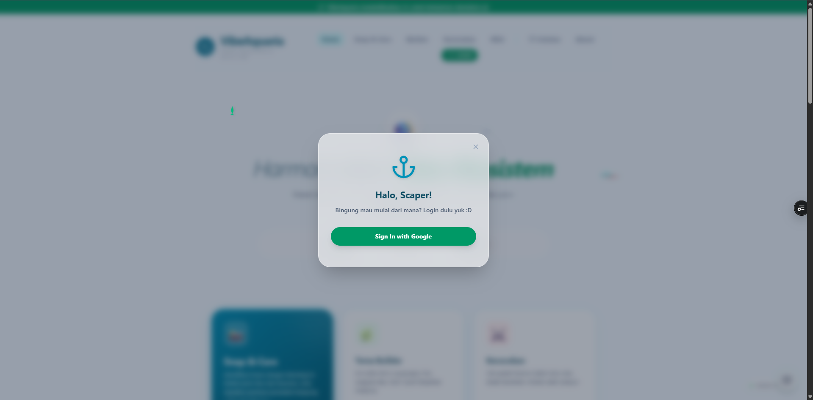

Mantap, Nafis! Link Vercel sudah ada, strategi gambar sudah siap. Sekarang kita rapihkan lagi README-nya biar juri makin terpesona sama detailnya.

Saya sudah tambahkan posisi preview.png dan beberapa informasi tambahan seperti "Unique Selling Point" dan "Performance Optimization". Ini bakal nunjukkin kalau kamu bukan sekadar "asal koding", tapi mikirin performa juga.

Silakan salin kode ini untuk file README.md kamu:

Markdown
# 🐠 VibeAquaria - Smart Aquascape Management System

<p align="center">
  
</p>

VibeAquaria adalah platform manajemen akuarium pintar yang menggabungkan estetika visual dengan teknologi **Google Gemini AI**. Proyek ini dikembangkan khusus sebagai entri untuk kompetisi **JuaraVibeCoding 2026**.

🌐 **Live Demo:** [vibe-aquaria.vercel.app](https://vibe-aquaria.vercel.app/)

---

## 🚀 Fitur Utama

### 1. 🔍 Snap & Care (AI Detection)
Fitur berbasis AI untuk mengidentifikasi spesies ikan dan memberikan panduan perawatan (suhu & pH) secara otomatis melalui analisis gambar. Memudahkan pemula untuk menjaga ekosistem yang sehat.

### 2. 💬 Konsultasi AI
Asisten virtual cerdas yang membantu pengguna memberikan solusi terkait ekosistem aquascape, penyakit ikan, hingga dekorasi secara real-time.

### 3. 🌊 Aquatic Interactive UI
Antarmuka yang responsif dengan efek kursor ikan dinamis dan tema *Glassmorphism*, memberikan pengalaman pengguna yang imersif seolah berada di dalam air.

---

## 💎 Mengapa VibeAquaria? (Unique Selling Point)

*   **Eco-Friendly Tech:** Membantu menekan angka kematian ikan hias dengan edukasi berbasis AI.
*   **Performance Optimized:** Dibangun menggunakan Next.js 14 untuk kecepatan loading yang maksimal dan SEO yang ramah.
*   **Scalable Architecture:** Struktur folder yang rapi memudahkan pengembangan fitur baru seperti sensor IoT di masa depan.

---

## ⚠️ Informasi Penting (API Key & Deployment)

Aplikasi ini dirancang untuk beroperasi menggunakan **Gemini API Key**. Namun, demi keamanan dan kepatuhan aturan lomba:

*   **Tanpa API Key di Repositori:** Repositori ini **TIDAK** menyertakan API Key spesifik.
*   **Versi Cloud Run:** Dikonfigurasi tanpa kredensial API backend untuk menghindari kendala autentikasi platform saat penilaian.
*   **Fungsionalitas AI:** Untuk melihat AI bekerja 100%, silakan merujuk pada **Video Demo** yang dilampirkan dalam submisi.

---

## 🛠️ Tech Stack

*   **Frontend:** Next.js 14 (App Router)
*   **AI Engine:** Google Gemini AI
*   **Animations:** Framer Motion
*   **Styling:** Tailwind CSS
*   **Deployment:** Google Cloud Run & Vercel

---

## 📂 Cara Menjalankan Lokal

1. Clone repositori ini.
2. Buat file `.env.local` di root folder.
3. Tambahkan baris: `NEXT_PUBLIC_GEMINI_API_KEY=YOUR_OWN_API_KEY`.
4. Jalankan perintah:
   ```bash
   npm install
   npm run dev
   
Dikembangkan dengan ❤️ oleh Nafis untuk JuaraVibeCoding 2026.
